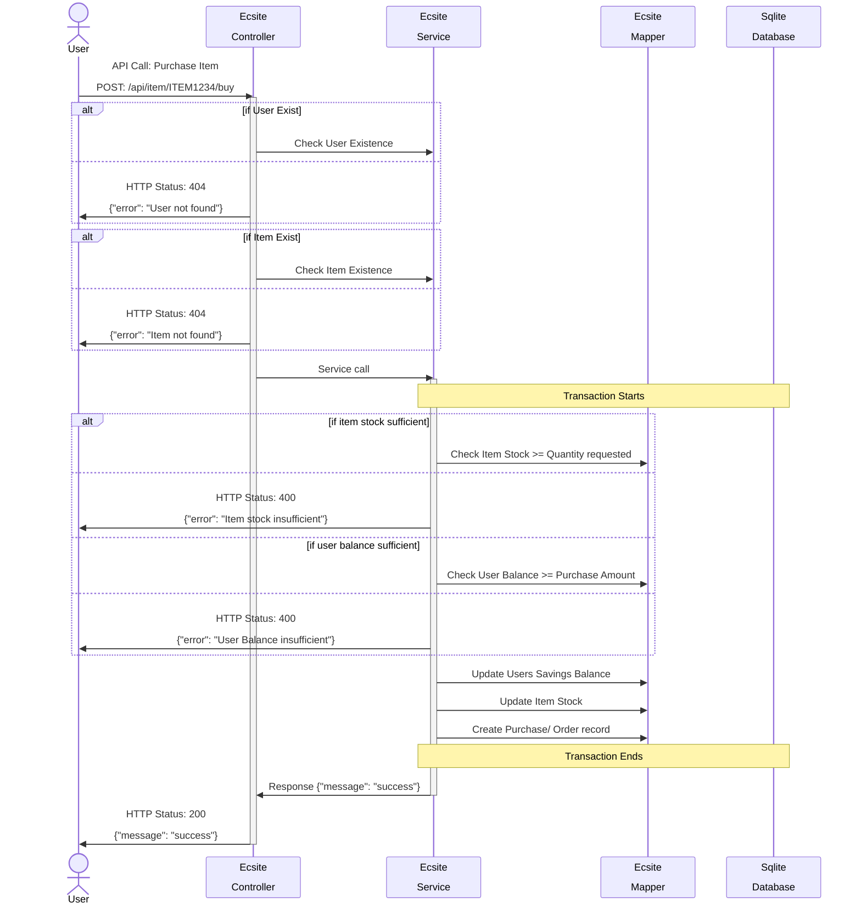
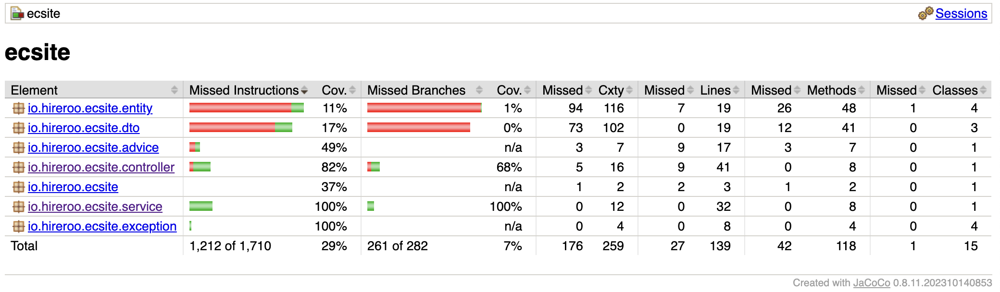

# Example documentation: E-Commerce Site Application

[Repository URL](https://github.com/rohitanand7890/E-CommerceSite)

This is a Java Spring Boot project designed for e-commerce operations. This application demonstrates transactional order processing, global exception handling, and RESTful API design, utilizing technologies such as Spring Boot, SQLite, and MyBatis.

## Project Overview

This project provides a backend for e-commerce operations, emphasizing transaction integrity, data consistency, and error handling:

### Transactional Order Processing

The application employs Spring Boot's `@Transactional` annotation with isolation level `SERIALIZABLE` to ensure each order is processed consistently and isolated, safeguarding against concurrent transaction anomalies.

```java title="@Trasactional annotation for resource locking"
    @Transactional(isolation = Isolation.SERIALIZABLE, timeout = 6)
    public ResponseMessage createOrder(CreateOrder createOrder) throws InsufficientItemStockException, InsufficientUserBalanceException {
        // Transactional logic
    }
```

### Global Exception Handling

`@RestControllerAdvice` is used to catch and handle exceptions globally, ensuring any errors are processed uniformly, providing clear feedback to the client.

```java linenums="1" hl_lines="2 3"  
    @RestControllerAdvice
    public class ApplicationExceptionHandler {
        // Exception handling methods
    }
```

## Highlights

- **Create Order Concurrency Integration Test**: Implemented comprehensive integration tests at both the controller and service levels to ensure that only one 1 is processed when the Item Stock is 1, even if multiple order requests( Used 9 concurrent requests) are received concurrently. This guarantees the integrity of order processing under high load and prevents stock inconsistencies.
  - [EcsiteControllerConcurrencyIntegrationTest](./src/test/java/io/hireroo/ecsite/controller/EcsiteControllerConcurrencyIntegrationTest.java)
  - [EcsiteServiceConcurrencyIntegrationTest](./src/test/java/io/hireroo/ecsite/service/EcsiteServiceConcurrencyIntegrationTest.java)

## Technology Stack

- **Spring Boot 3.1.4**: Framework
- **SQLite**: SQL Database
- **MyBatis**: Database ORM
- **Java 21**: Programming Language
- **Mockito**: Testing Framework

## Getting Started

To get the application running locally:

1. Ensure JDK 21 is installed.
2. Start the application:
    ```bash
    mvn spring-boot:run
    ```

## API Endpoints

Manage items, users, and orders through these endpoints:

- **Items**:
    - `GET /api/item/{id}`: Retrieves an item's details.
    - `POST /api/item`: Adds a new item.
    - `DELETE /api/item/{id}`: Removes an item.

- **Users**:
    - `GET /api/user/{id}`: Fetches user details.
    - `POST /api/user`: Creates a user account.
    - `DELETE /api/user/{id}`: Deletes a user account.

- **Orders**:
    - `POST /api/item/{item_id}/buy`: Processes an item purchase.

## Purchase Process Sequence Diagram

The sequence diagram below illustrates the steps involved in the purchase process:

### Purchase Product `POST: /api/item/{item_id}/buy`



## Testing

Run unit tests with:

```bash
  mvn test
```
Generate Test Coverage Report with:

```bash
  mvn clean test jacoco:report
```

## JaCoCo Test Coverage Report
image


## ToDo's and Future Improvements

- **Swagger API Schema**: To enhance API documentation and user interaction.
- **Linter in Pre-commit**: To maintain code quality and ensure style consistency.
- **Refactor Validation Logic**: For improved data integrity at the service level.
- **Circuit Breaker Mechanism**: Implement using `Resilience4j` for better fault tolerance.
- **Soft Delete for Items**: Modify deletion logic for items to allow data recovery and maintain History records.
