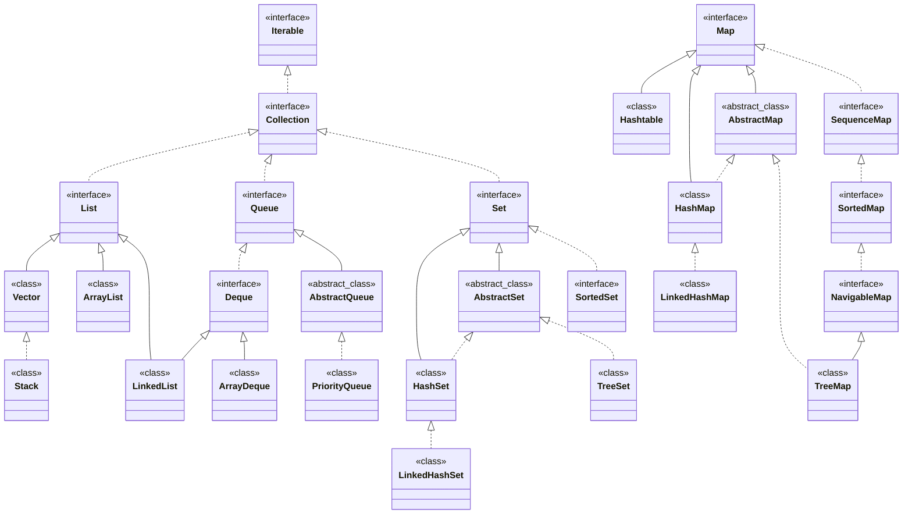
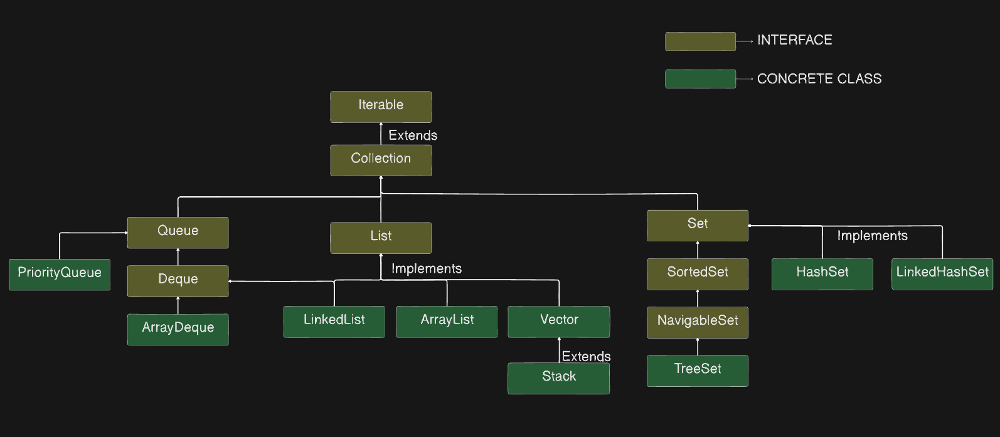
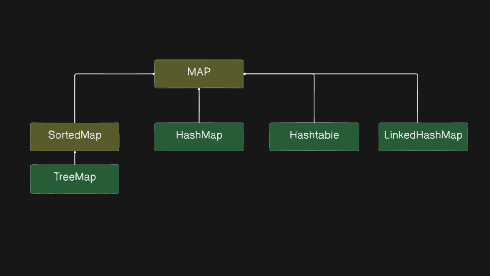

# Java Interview Questions

## Collection framework Hierarchy in Java 

### package java.util; 

### Simplified Structure

### Question 1: What is the difference between HashMap and ConcurrentHashMap in Java ?

#### HashMap
- **Not Synchronized**: `HashMap` is not thread-safe, which means that if multiple threads access it concurrently and at least one of the threads modifies the map structurally, it must be synchronized externally.
- **Null Values**: `HashMap` allows one null key and multiple null values.
- **Performance**: Because it's unsynchronized, `HashMap` offers better performance in environments where thread safety is not a concern.
- **Iterators**: The iterators returned by `HashMap` are fail-fast, which means they throw a `ConcurrentModificationException` if the map is structurally modified after the iterator is created, except through the iterator's own `remove` method.

#### ConcurrentHashMap
- **Thread Safety**: `ConcurrentHashMap` is thread-safe and provides concurrency support by segmenting the map into different parts and locking only a portion of the map during updates. This allows concurrent reads and writes to the map, increasing performance in multi-threaded environments.
- **No Null Values**: `ConcurrentHashMap` does not allow null keys or null values. Attempting to store a null key or value will throw a `NullPointerException`.
- **Performance**: While `ConcurrentHashMap` is slower than `HashMap` due to its thread-safe nature, it is faster than a `Hashtable` or a synchronized `HashMap` (synchronized externally with `Collections.synchronizedMap`) under high concurrency.
- **Iterators**: The iterators returned by `ConcurrentHashMap` are weakly consistent, which means they reflect the state of the map at some point at or since the creation of the iterator. They do not throw `ConcurrentModificationException` but are designed to be used by concurrent threads.
- **Concurrent Operations**: `ConcurrentHashMap` includes additional methods to support concurrent operations, like `putIfAbsent`, `remove`, and `replace`, which perform atomic check-and-act operations.

In summary, `HashMap` should be used in non-threaded or single-threaded environments, or when the map does not require concurrent access/modification. `ConcurrentHashMap` is the preferable choice in multi-threaded applications where the map is accessed by concurrent threads and high performance is required.

### Question 2: What will be the difference with `ConcurrentHashmap` when we make the HashMap `synchronized` ?

**Answer :**
Making a `HashMap` synchronized typically means wrapping it using `Collections.synchronizedMap()`. This provides a basic level of thread safety by ensuring that each individual operation on the `HashMap` is synchronized. However, there are still significant differences between a synchronized `HashMap` and a `ConcurrentHashMap`:

#### Synchronized HashMap
- **Method-Level Synchronization**: Every method call on the `HashMap` is synchronized, so only one thread can access the map at a time for any operation.
- **Single Lock**: There is a single lock for the entire map, which can lead to contention when many threads are accessing the map concurrently.
- **Iterator Safety**: The iterators for the synchronized `HashMap` are not thread-safe. If one thread is iterating over the map while another thread modifies it, a `ConcurrentModificationException` may be thrown. External synchronization is needed during iteration to avoid this exception.
- **Concurrent Access**: Multiple readers or a writer and a reader cannot access the map at the same time. This can be a significant performance bottleneck.

#### ConcurrentHashMap
- **Segment-Level Locking**: `ConcurrentHashMap` uses multiple locks on segments of the map, allowing concurrent access to different segments and only locking a segment during writes. This minimizes contention and improves performance.
- **Lock Stripping**: `ConcurrentHashMap` employs a technique called lock stripping, which uses a finer-grained locking mechanism for higher concurrency.
- **Iterator Safety**: Iterators in `ConcurrentHashMap` are weakly consistent and do not throw `ConcurrentModificationException`, allowing non-blocking reads and updates to the map during iteration.
- **Enhanced Concurrent Access**: Multiple readers can access the map concurrently without locking, and writers can add or update without blocking readers. This allows higher levels of concurrency.

In short, while you can make a `HashMap` thread-safe by synchronizing it, `ConcurrentHashMap` is designed for higher throughput in concurrent scenarios and can handle multiple readers and writers efficiently. Synchronized `HashMap` is a more conservative approach where every operation is thread-safe but potentially slower under high concurrency due to the coarse-grained lock mechanism.

### Question 3: Difference Between Volatile, Atomic And Synchronized in Java
### Question 4: Transient Keyword in Java
### Question 5: strictfp Keyword in Java
### Question 6: HasMap vs Hashtable
### Question 7: Semaphores in Java

### Question 8: final, finally{} vs finalize(): finalize is depricated since Java 9  

#### final: Restrict the modification
    variable: cannot modify its value
    method: cannot be override 
    class: cannot be extended

#### finally{} : Block of code written generally after try catch block which will be executed always no matter what

#### finalize(): part of object class, invoked by GC just before garbage collection for some clean up activity 
    finalize is depricated since Java 9 

### Question 9: Why `Map` is not under `Collections`?

#### 
- All Collection Classes have `Value` parameter and the methods are designed to provide implementation around `Value`. 
- While `Map` has `Key-value` parameter

### Question 9: `HashMap` internal implementation?

#### Hash functions: eg: MD1, SH256, Custom hashcode implementation

**Node:** 

- hash

- key

- value

- next Node<K, V>

**Default initial capacity :** 

- 1>>4 i.e. 16 

**Map Internally Stores data:**

- Hash Collision

  -     put(5, "abc") -> 61610 

  -     get(5) -> hash() -> 61610 % 16(capacity)  -> gives index -> iterate over list to find key `5` 
          i.e. compares `hash` and `value`

**Contract b/w Hashcode and equals method**

1. if obj1 == obj2 their hash should be also same
2. if 2 objects hash is same, doesn't mean objects are same.

**Load Factor:** 
* `Default = 0.75` -> 16 * 0.75 = 12
* increases or doubles the size of hashmap when load factor is reached, HashMap does rehash

**Treefy Threshold = 8 (it is also called `Bin count`)**
* Converts the LinkedList O(n) into Tree, its a Balanced Binary Search tree(Red -Black tree),
* Searching would be in O(log(n))

**TIme Complexity**

* `Add`: Amortized O(1) i.e average
* `Remove`: Amortized O(1)
* `Get`: amortized O(1)